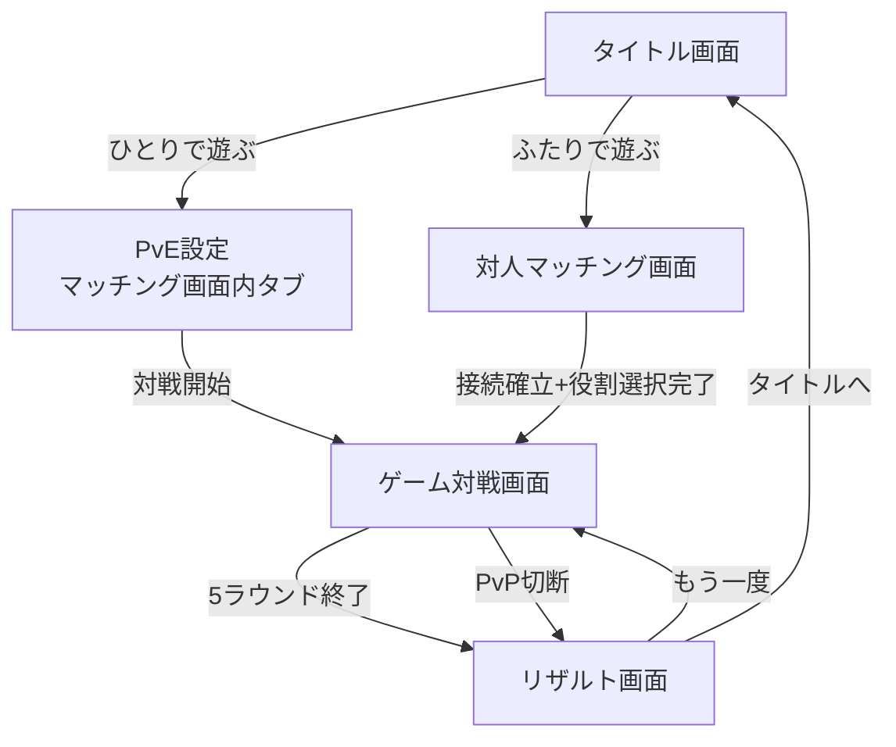
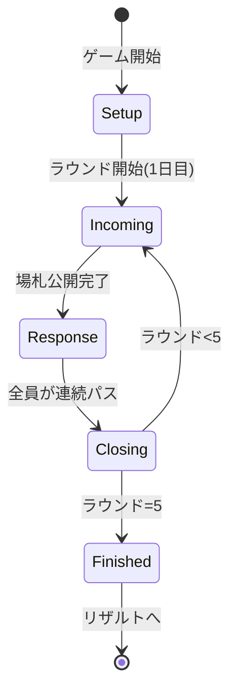
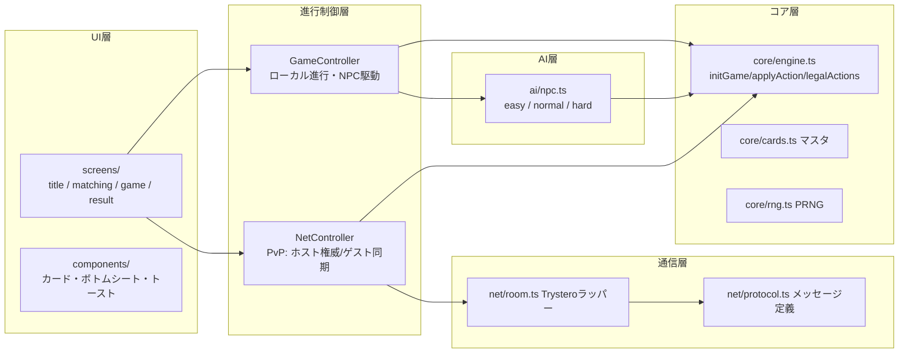
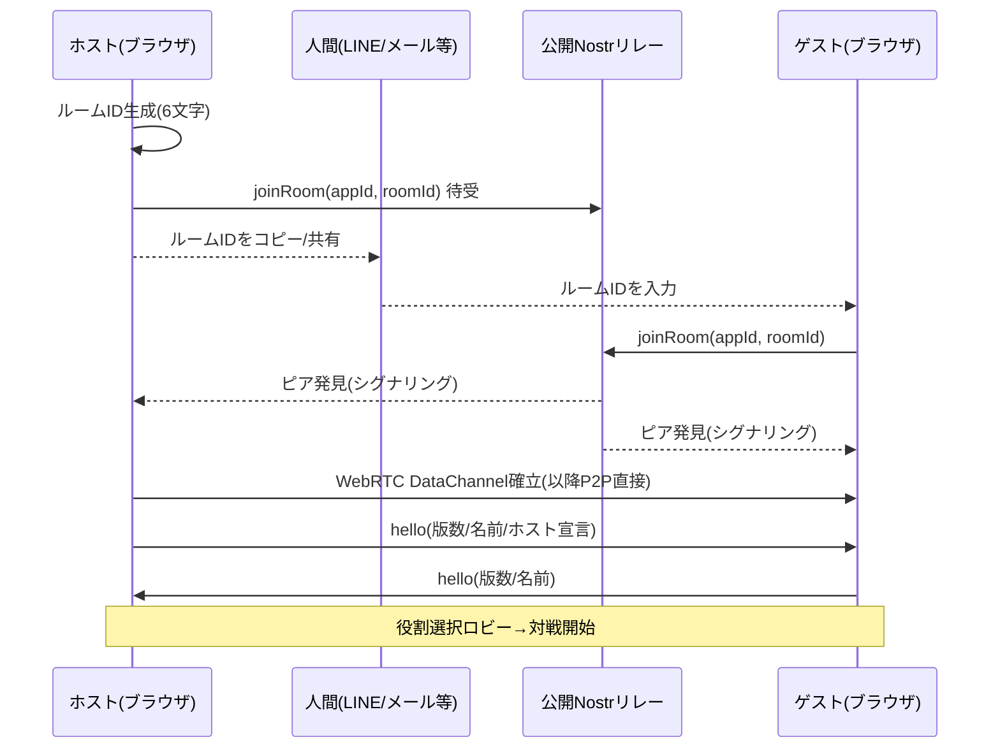

# 「情シス、出動。」Web版 詳細設計書

〜5営業日サバイバル・カードゲーム〜 ブラウザ版(スマホ縦画面最適化)

| 項目 | 内容 |
| --- | --- |
| 版 | v0.2(P2P方式をTrysteroに変更) |
| 原作 | 「情シス、出動。」テストプレイ版ルールブック+カード一覧(PDF) |
| 対象プラットフォーム | スマートフォンのモバイルブラウザ(縦持ち)。PCブラウザでも動作 |
| ホスティング | GitHub Pages(純静的サイト) |
| 技術制約 | HTML + TypeScript(JavaScript) + Node.js(ビルド用途のみ)。サーバーサイド常駐プロセスなし |

---

## 目次

1. [概要](#1-概要)
2. [要件定義](#2-要件定義)
3. [画面設計](#3-画面設計)
4. [ゲームルール仕様](#4-ゲームルール仕様)
5. [カードマスタデータ](#5-カードマスタデータ)
6. [データモデル(TypeScript型定義)](#6-データモデルtypescript型定義)
7. [アーキテクチャ設計](#7-アーキテクチャ設計)
8. [PvP通信設計(サーバーレスP2P)](#8-pvp通信設計サーバーレスp2p)
9. [NPC AI設計](#9-npc-ai設計)
10. [ビルド・デプロイ設計](#10-ビルドデプロイ設計)
11. [テスト方針](#11-テスト方針)
12. [未決事項・レビューポイント](#12-未決事項レビューポイント)

---

## 1. 概要

プレイヤーは同じ会社の情シス部門のメンバー。それぞれ専門分野(役割)を持ち、5営業日(5ラウンド)の間に降ってくるトラブルカードを工数を支払って解決し、最も多くの評価ポイントを獲得した人が「今期のMVP情シス」として勝利する。

本プロジェクトはこのカードゲームを **Webブラウザだけで遊べるデジタル版** にする。

- **PvEモード**: NPC(1〜3体、難易度「弱い」「ふつう」「つよい」)と対戦
- **PvPモード**: ルームIDを発行して相手に直接伝えてマッチングする、自前サーバー不要のP2P対戦(当面は2人対戦。設計は最大4人を見据える)

### 1.1 スコープ

| 項目 | 今回のスコープ | 将来拡張 |
| --- | --- | --- |
| PvE | 1人 + NPC 1〜3体(合計2〜4人戦) | — |
| PvP | 2〜4人対戦(2人以上そろえばホストが開始可能。ロビーへの途中参加可) | — |
| 画面 | タイトル/マッチング/ゲーム対戦/リザルト | 遊び方(ルール説明)画面 |
| 通信 | Trystero(WebRTC。マッチングは公開Nostrリレー経由) | QRコードによるルームID受け渡し |

---

## 2. 要件定義

### 2.1 機能要件

| ID | 要件 |
| --- | --- |
| F-01 | 原作ルールブック準拠のゲーム進行(5ラウンド、着信→対応→定時の3フェイズ) |
| F-02 | トラブルカード40枚・イベントカード3枚・役割カード4枚の完全収録 |
| F-03 | 役割の専門分野割引(コスト−1・最低1)と解決時評価+1の自動適用 |
| F-04 | 固有スキル4種(各1ゲーム2回まで)の使用 |
| F-05 | 【緊急】カード残置時の全員評価−1の自動処理 |
| F-06 | PvEモード: NPC数(1〜3)と難易度(弱い/ふつう/つよい)を選択して対戦 |
| F-07 | PvPモード: ルームIDの受け渡しによるP2Pマッチングと最大4人対戦(ホスト+1人以上でホストが開始可能) |
| F-08 | プレイヤー人数(2〜4)に応じた山札調整と場札枚数(人数+2)の自動処理 |
| F-09 | リザルト画面で順位・評価内訳・MVP表示、再戦/タイトルへ戻る導線 |
| F-10 | ゲームログ(誰が何を解決したか)の表示 |

### 2.2 非機能要件

| ID | 要件 |
| --- | --- |
| N-01 | スマホ縦画面(幅360px〜)で全操作が完結。タップターゲット44px以上 |
| N-02 | GitHub Pagesで公開可能(ビルド成果物は静的ファイルのみ、相対パス動作) |
| N-03 | 外部CDNに依存しない(全アセットをバンドル)。PvPマッチング時のみ公開Nostrリレー+公開STUNを利用し、ゲーム進行データはP2P直接通信(§8.5参照) |
| N-04 | オフラインでもPvEはプレイ可能(初回ロード後) |
| N-05 | ゲームロジックは決定論的(同じシード+同じ操作列→同じ結果)でテスト可能 |
| N-06 | 1ゲーム約10分。NPCの思考時間は0.5〜1.5秒程度の演出待ちのみ |

### 2.3 制約

- 使用技術は HTML + TypeScript(JavaScript) + Node.js のみ。Node.js はビルドツールチェーン(Vite等)としてのみ使用し、実行時サーバーは持たない。
- UIフレームワーク(React等)は使わず、Vanilla TypeScript + DOM で実装する(依存最小化)。
- マッチング用の自前シグナリングサーバーは立てない。P2P確立にはTrysteroライブラリを採用し、公開インフラ(Nostrリレー)をシグナリングにのみ利用する(§8参照)。

---

## 3. 画面設計

### 3.1 画面遷移図



- 画面はSPA内の状態として管理する(URLルーティングなし。リロード=タイトルに戻る)。
- PvPの「もう一度」は接続維持中のみ可能(ホストが再戦を提案→ゲスト承諾で同メンバー・新シードで開始)。

### 3.2 タイトル画面

```
┌─────────────────────┐
│                     │
│    情シス、出動。      │
│  〜5営業日サバイバル〜  │
│                     │
│ ┌─────────────────┐ │
│ │  ひとりで遊ぶ(PvE) │ │
│ └─────────────────┘ │
│ ┌─────────────────┐ │
│ │  ふたりで遊ぶ(PvP) │ │
│ └─────────────────┘ │
│ ┌─────────────────┐ │
│ │   あそびかた       │ │
│ └─────────────────┘ │
│                     │
│  プレイヤー名 [______] │
└─────────────────────┘
```

- プレイヤー名は `localStorage` に保存し次回から自動入力(未入力時は「あなた」)。
- 「あそびかた」はモーダルでルール概要を表示(将来拡張だが枠だけ用意)。

### 3.3 マッチング画面

上部タブで「PvE設定」と「PvP接続」を切り替える(タイトルからの導線で初期タブが決まる)。

#### PvE設定タブ

```
┌─────────────────────┐
│ ← もどる   ひとりで遊ぶ │
│                     │
│ NPCの人数            │
│  [ 1 ] [ 2 ] [ 3 ]  │
│                     │
│ NPC 1: つよさ        │
│  [弱い][ふつう][つよい] │
│ NPC 2: つよさ …      │
│                     │
│ じぶんの役割          │
│  [CSIRT][インフラ]    │
│  [アプリ開発][ヘルプ]  │
│  [おまかせ(ランダム)]  │
│                     │
│ ┌─────────────────┐ │
│ │    対戦開始       │ │
│ └─────────────────┘ │
└─────────────────────┘
```

- NPCの役割は、プレイヤー選択後の残りからランダムに割り当てる。
- NPCごとに難易度を個別設定できる。

#### PvP接続タブ(ルームID方式)

ホスト側とゲスト側で表示が分岐する。

```
【ホスト】                      【ゲスト】
┌─────────────────────┐      ┌─────────────────────┐
│ ← もどる  ふたりで遊ぶ  │      │ ← もどる  ふたりで遊ぶ  │
│ [部屋を作る][部屋に入る]│      │ [部屋を作る][部屋に入る]│
│ ─────────────────── │      │ ─────────────────── │
│ あなたのルームID        │      │ 相手から聞いたルームIDを │
│ ┌─────────────────┐ │      │ 入力してください        │
│ │   J S 4 K 7 M    │ │      │ ┌─────────────────┐ │
│ └─────────────────┘ │      │ │ [______]         │ │
│ [コピー] [共有]        │      │ └─────────────────┘ │
│                     │      │ ┌─────────────────┐ │
│ このIDを相手に伝えて     │      │ │   入室する        │ │
│ 入室を待っています…     │      │ └─────────────────┘ │
└─────────────────────┘      └─────────────────────┘
```

- ルームIDは紛らわしい文字(0/O、1/I等)を除いた英数6文字を自動生成。`navigator.clipboard` の「コピー」と Web Share API の「共有」ボタン(LINE等へ直接送れる)を用意する。
- 接続確立後、同画面内で **役割選択ロビー** に切り替わる: 4役割から各自1つ選択(早い者勝ち、ホスト調停)。両者選択完了でホストの「対戦開始」が有効化。
- 90秒待っても相手が来ない場合はタイムアウト表示(部屋は維持し「待ち続ける」も選べる)。
- 詳細な通信シーケンスは§8。

### 3.4 ゲーム対戦画面(メイン)

スマホ縦1画面に収める。上から「状況バー」「相手情報」「場札」「自分情報+操作」の4段構成。

```
┌─────────────────────┐
│ 3日目/5日  対応フェイズ │ ← 状況バー(ラウンド/フェイズ)
│─────────────────────│
│ 🤖ノーマルNPC ★7 ⚙2   │ ← 相手情報(評価★・残工数⚙・
│ 🧑よしだ    ★5 ⚙3 ◀  │    手番マーク◀。人数分表示)
│─────────────────────│
│ ┌───────┐ ┌───────┐ │
│ │🔴緊急   │ │🟡      │ │ ← 場札(人数+2枚、2列グリッド
│ │ランサム  │ │パスワード│ │    。タップで詳細+解決操作)
│ │ウェアの疑い│ │忘れ(3回目)│ │
│ │⚙3 ★4  │ │⚙1 ★1  │ │
│ └───────┘ └───────┘ │
│ ┌───────┐ ┌───────┐ │
│ │…      │ │…      │ │
│ └───────┘ └───────┘ │
│─────────────────────│
│ あなた🧑 CSIRT ★6 ⚙2  │ ← 自分情報(役割・評価・残工数)
│ スキル残:2 [インシデント指揮]│
│ ┌────────┐ ┌───────┐│
│ │  パス    │ │ ログ📜  ││ ← 操作バー
│ └────────┘ └───────┘│
└─────────────────────┘
```

- **場札タップ** → ボトムシートでカード詳細(カテゴリ色・緊急表示・コスト・評価・割引後コスト)と「解決する(⚙n払う)」ボタン。スキルが適用可能なら「スキルを使う」トグルを表示。
- **自分の手番以外**は場札の解決ボタンを無効化(閲覧は可能)。
- **フェイズ演出**: 着信フェイズはカードが1枚ずつめくれる演出、イベントカードはモーダルで効果を通知、定時フェイズは緊急残置ペナルティ・工数返却の結果をトースト表示。
- **ログ📜**: ボトムシートで行動履歴(「よしだ が Y1 を解決 ★1」等)を時系列表示。
- カテゴリ色: 黄=ユーザーサポート/青=インフラ/赤=セキュリティ/緑=アプリ開発/灰=理不尽枠(原作PDFの配色を踏襲)。

### 3.5 リザルト画面

```
┌─────────────────────┐
│    🏆 今期のMVP情シス   │
│      よしだ (★14)     │
│─────────────────────│
│ 1位 よしだ   ★14 (8枚) │
│ 2位 NPC強   ★12 (7枚) │
│ 3位 NPC弱   ★4  (3枚) │
│─────────────────────│
│ 内訳(タップで展開)      │
│  解決評価 +16 / 緊急−2 │
│─────────────────────│
│ ┌─────────────────┐ │
│ │    もう一度       │ │
│ └─────────────────┘ │
│ ┌─────────────────┐ │
│ │   タイトルへ       │ │
│ └─────────────────┘ │
└─────────────────────┘
```

- 同点時は解決枚数で順位付け、それも同じなら「合同MVP」として並べて表示(原作準拠)。
- PvPで切断終了した場合は「通信が切断されました」と表示し、その時点のスコアを参考表示する。

### 3.6 スマホ最適化方針

- ビューポートは `100dvh` 基準・`env(safe-area-inset-*)` 対応。縦スクロールは場札領域のみ(4人戦時に6枚になるため)。
- コンテナ最大幅 480px・中央寄せ(PCでもスマホ風表示)。
- タップターゲット44px以上、ダブルタップズーム抑止(`touch-action: manipulation`)。
- フォントはシステムフォントスタック(外部フォント不使用)。

---

## 4. ゲームルール仕様

原作ルールブックをデジタル処理として厳密化する。原文が曖昧な箇所の解釈は§4.7にまとめる(**要レビュー**)。

### 4.1 ゲーム全体フロー



### 4.2 セットアップ(Setup)

1. 参加人数 `n`(2〜4)を確定し、各プレイヤーに役割カードを1枚割り当てる(重複なし)。
2. **山札調整**: 使用されなかった役割の専門カテゴリのトラブルカードを、カテゴリごとに3枚ランダムに抜く。
   - 4人戦: 40枚全部(調整なし)
   - 3人戦: 未使用1役割 → 3枚抜いて37枚(原作の3人ルール)
   - 2人戦: 未使用2役割 → 各3枚、計6枚抜いて34枚(3人ルールの拡張。§12参照)
   - 理不尽枠(灰)はどの役割の専門でもないため抜かない。
3. トラブルカード(調整後)とイベントカード3枚をシャッフルして山札にする。
4. 各プレイヤーに工数トークン3個を配る。
5. スタートプレイヤーをランダムに決定(原作の「直近でPCを再起動した人」の代替)。

### 4.3 着信フェイズ(Incoming)

1. 山札から「n+2」枚を1枚ずつめくり場に公開する。
2. **イベントカードがめくれた場合**: 効果を即適用して捨て札にし、代わりのトラブルカードを1枚補充する(場のトラブルカードは常にn+2枚)。補充でさらにイベントがめくれたら同様に繰り返す。
3. 「大型連休明け」が適用された場合、このラウンドの場札は n+2+2 枚になる(補充ではなく追加公開)。
4. 山札が尽きた場合は捨て札(解決済み以外の捨て札)を再シャッフルして山札にする。それでも足りなければ、めくれた分だけで進行する。

### 4.4 対応フェイズ(Response)

- スタートプレイヤーから時計回り(参加登録順の循環)に手番が回る。
- 手番でできることは次のいずれか1つ:
  - **解決**: 場のトラブルカードを1枚選び、支払いコスト分の工数トークンを支払って自分の獲得札にする。
  - **パス**: 何もしない。パスしても手番はまた回ってくる。
- **支払いコスト** = カードの印刷コスト − 専門割引(専門分野一致で−1、最低1)− 自動化スクリプト(使用時、コスト0)。
- **獲得評価** = 印刷評価 + 専門ボーナス(+1)+ インシデント指揮(+1)+ 監査イベント(+1)。神対応使用時はこの合計を2倍(§4.6)。
- **ラウンド終了条件**: 全員が「連続で」パスしたら対応フェイズ終了(n人連続パス。誰かが解決したらカウントはリセット)。
- 工数が足りないカードは選択できない(UIで無効表示)。全カードが支払い不能な場合はパスのみ。

### 4.5 定時フェイズ(Closing)

1. 場に【緊急】カードが残っていたら、**全員**の評価を残枚数分だけ−1する(評価は負値も許容。§4.7-6)。
2. 場に残ったカードをすべて捨て札にする。
3. 未使用の工数トークンを返却する。ただしインフラ担当が「冗長構成」を宣言した場合、そのプレイヤーは残工数をすべて次ラウンドへ繰り越す(次ラウンド開始時 3+繰越個)。
4. スタートプレイヤーを左隣(次の順番のプレイヤー)に移し、次のラウンドへ。5ラウンド終了ならゲーム終了。

### 4.6 役割・スキル仕様

共通: 専門分野と同カテゴリのカードは **コスト−1(最低1)・解決時評価+1**。固有スキルは **1ゲームに2回まで**。スキル使用は本人の任意宣言(自動発動しない)。

| 役割 | 専門 | スキル | デジタル版の厳密な処理 |
| --- | --- | --- | --- |
| CSIRT | セキュリティ(赤) | インシデント指揮 | 【緊急】カードを解決する際に宣言 → そのカードの獲得評価に+1。解決アクションのオプションとして指定 |
| インフラ担当 | インフラ(青) | 冗長構成 | 定時フェイズ開始時に宣言 → 残工数を全て次ラウンドに繰り越す(通常は返却)。第5ラウンドでは宣言不可(次がないため) |
| アプリ開発担当 | アプリ/開発(緑) | 自動化スクリプト | 解決アクションのオプションとして宣言 → 対象カードが「自分が直近に解決したカード」と同カテゴリなら支払いコスト0で解決。専門ボーナス等の評価加算は通常どおり |
| ヘルプデスク担当 | ユーザーサポート(黄) | 神対応 | **印刷コスト1**のカードを解決する際に宣言 → そのカードの獲得評価(加算合計後)を2倍にする |

評価計算の適用順序(擬似コード):

```
gain = card.printedEval
if (player.role.specialty === card.category) gain += 1
if (インシデント指揮を宣言 && card.urgent)   gain += 1
if (監査イベント有効 && card.category === "security") gain += 1
if (神対応を宣言 && card.printedCost === 1)  gain *= 2
player.score += gain
```

### 4.7 ルール解釈一覧(要レビュー)

原文に明記がなくデジタル化にあたり確定させた解釈。**変更希望があればレビューで指摘してください。**

| # | 論点 | 採用した解釈 | 根拠・代替案 |
| --- | --- | --- | --- |
| 1 | 神対応の「コスト1のカード」 | **印刷コスト1**のカードのみ対象(専門割引で1になったカードは対象外) | カード表記に忠実。代替: 支払いコスト1で判定(強くなる) |
| 2 | 神対応の「評価を2倍」 | 専門ボーナス等の加算を全て合計した後に2倍 | プレイ感重視。代替: 印刷評価のみ2倍(+加算) |
| 3 | 自動化スクリプトの「直前に自分が解決した」 | ラウンドをまたいでも有効な「自分の直近の解決カード」と同カテゴリ | 原文に「同ラウンド」の限定なし。代替: 同ラウンド内限定 |
| 4 | 自動化スクリプトは手番を消費するか | 通常の解決アクションとして手番を消費する(追加手番ではない) | 「工数0で解決」の記述のみのため最小解釈 |
| 5 | 冗長構成の宣言タイミング | 定時フェイズの工数返却前に宣言 | ルールブックの「定時フェイズ…(スキル使用時を除く)」に整合 |
| 6 | 評価の下限 | 負値を許容(緊急ペナルティで0未満になり得る) | 原文に下限記載なし。代替: 0で打ち止め |
| 7 | スタートプレイヤー決定 | シード付き乱数でランダム | 「直近でPC再起動した人」は物理ジョーク要素のため |
| 8 | イベントの重複適用 | 「監査が入る」「大型連休明け」が同一ラウンドに複数めくれた場合も各々適用(監査+監査=+2) | イベントは各1枚のため実際は起きないが、着信で複数種同時は起こり得る |
| 9 | 山札切れ | 捨て札を再シャッフルして継続 | 2〜4人の通常進行では発生しないが保険として定義 |
| 10 | 2人戦の山札調整 | 未使用2役割の専門カテゴリから各3枚(計6枚)ランダムに抜く | 原作3人ルール「3枚ほど抜く」の線形拡張 |

---

## 5. カードマスタデータ

カード一覧PDFからの完全転記。実装では `src/core/cards.ts` に定数配列として持つ。

### 5.1 トラブルカード(40枚)

#### ユーザーサポート(黄・9枚)

| ID | カード名 | 緊急 | コスト | 評価 |
| --- | --- | :-: | :-: | :-: |
| Y1 | パスワードを忘れました(3回目) | | 1 | 1 |
| Y2 | Wi-Fiが繋がらない(会議5分前) | 🔴 | 1 | 1 |
| Y3 | プリンタが動かない(役員会直前) | 🔴 | 1 | 1 |
| Y4 | Excelが重いんだけど | | 1 | 1 |
| Y5 | メールが消えた(ゴミ箱にある) | | 1 | 1 |
| Y6 | Web会議に入れない偉い人 | 🔴 | 2 | 2 |
| Y7 | 新入社員10名分のキッティング | | 3 | 3 |
| Y8 | 「なんか変」としか言わない問い合わせ | | 2 | 2 |
| Y9 | 全社ITリテラシー研修をやってほしい | | 3 | 3 |

#### インフラ(青・9枚)

| ID | カード名 | 緊急 | コスト | 評価 |
| --- | --- | :-: | :-: | :-: |
| I1 | 野良SaaS発覚 | | 2 | 2 |
| I2 | サーバー室のエアコン故障 | 🔴 | 3 | 3 |
| I3 | 基幹サーバーのディスク残量1% | 🔴 | 3 | 4 |
| I4 | クラウド利用料が先月の3倍 | | 2 | 2 |
| I5 | VPN混雑で在宅勢が全滅 | 🔴 | 2 | 2 |
| I6 | スイッチのループでネットワーク全断 | 🔴 | 3 | 4 |
| I7 | SSL証明書の有効期限切れ | | 2 | 2 |
| I8 | オンプレからクラウドへ移行検討せよ | | 3 | 3 |
| I9 | UPSのバッテリー交換時期 | | 1 | 1 |

#### セキュリティ(赤・9枚)

| ID | カード名 | 緊急 | コスト | 評価 |
| --- | --- | :-: | :-: | :-: |
| S1 | 不審メール一斉着弾 | | 2 | 2 |
| S2 | ランサムウェアの疑い | 🔴 | 3 | 4 |
| S3 | フィッシング報告(もうクリック済) | 🔴 | 2 | 3 |
| S4 | 退職者のアカウントが残ってた | | 1 | 1 |
| S5 | USBメモリ紛失の報告 | 🔴 | 2 | 3 |
| S6 | 深刻な脆弱性(CVSS 9.8)公開 | | 2 | 2 |
| S7 | セキュリティ監査の資料づくり | | 3 | 3 |
| S8 | パスワード付きZIP文化の撲滅 | | 2 | 2 |
| S9 | 標的型メール訓練の実施 | | 2 | 2 |

#### アプリ/開発(緑・9枚)

| ID | カード名 | 緊急 | コスト | 評価 |
| --- | --- | :-: | :-: | :-: |
| A1 | マクロが壊れた(作った人は退職済) | | 2 | 2 |
| A2 | 基幹システム改修の要望(仕様は未定) | | 3 | 3 |
| A3 | 本番環境でバグ発覚 | 🔴 | 3 | 4 |
| A4 | 「ちょっとしたツール」の作成依頼 | | 2 | 2 |
| A5 | RPAが朝から止まってる | 🔴 | 2 | 2 |
| A6 | 勤怠システムが締め日にエラー | 🔴 | 2 | 3 |
| A7 | 古いブラウザでしか動かない社内システム | | 3 | 3 |
| A8 | API連携がサイレント仕様変更で死亡 | | 2 | 2 |
| A9 | リリース前日の仕様変更 | | 2 | 2 |

#### 理不尽枠(灰・4枚)

| ID | カード名 | 緊急 | コスト | 評価 |
| --- | --- | :-: | :-: | :-: |
| G1 | 役員のスマホ機種変(至急) | 🔴 | 2 | 1 |
| G2 | 社長が買ってきた謎ガジェットの接続 | | 2 | 1 |
| G3 | 「AIでなんかやって」との号令 | | 3 | 2 |
| G4 | 隣の部署の引っ越しに伴う配線作業 | 🔴 | 2 | 1 |

検算: 黄9+青9+赤9+緑9+灰4=40枚。【緊急】は黄3・青4・赤3・緑3・灰2=15枚(カテゴリ一覧の「インフラは緊急最多の4枚」と整合)。

### 5.2 イベントカード(3枚)

| ID | カード名 | 効果 | 有効期間 |
| --- | --- | --- | --- |
| E1 | 監査が入る | このラウンド、セキュリティ(赤)カードを解決したときの評価+1 | そのラウンドのみ |
| E2 | 大型連休明け | このラウンドの着信で、追加でトラブルカードを2枚公開する | 即時(着信フェイズ) |
| E3 | 予算が下りた | 全プレイヤー、直ちに工数トークン+1 | 即時 |

### 5.3 役割カード(4枚)

| ID | 役割 | 専門分野 | 固有スキル(2回まで) |
| --- | --- | --- | --- |
| R1 | CSIRT(セキュリティ担当) | セキュリティ(赤) | インシデント指揮: 【緊急】カードを解決したとき、さらに評価+1 |
| R2 | インフラ担当 | インフラ(青) | 冗長構成: 使わなかった工数を次ラウンドにすべて繰り越せる |
| R3 | アプリ開発担当 | アプリ/開発(緑) | 自動化スクリプト: 直前に自分が解決したのと同カテゴリのカードを工数0で解決 |
| R4 | ヘルプデスク担当 | ユーザーサポート(黄) | 神対応: コスト1のカードを解決したとき、評価を2倍にする |

---

## 6. データモデル(TypeScript型定義)

`src/core/types.ts` の骨子。**GameStateはJSONシリアライズ可能**にする(PvP同期・テストのため関数/クラスインスタンスを含めない)。

```ts
// ---- マスタデータ ----
export type Category = "support" | "infra" | "security" | "dev" | "unreasonable";

export interface TroubleCard {
  id: string;            // "Y1" など
  name: string;
  category: Category;
  urgent: boolean;
  cost: number;          // 印刷コスト
  eval: number;          // 印刷評価
}

export type EventId = "audit" | "holiday" | "budget";
export interface EventCard { id: EventId; name: string; }

export type RoleId = "csirt" | "infra" | "dev" | "helpdesk";
export interface RoleDef {
  id: RoleId;
  name: string;
  specialty: Category;
  skillName: string;
}

// ---- 対戦設定 ----
export type NpcLevel = "easy" | "normal" | "hard";
export interface PlayerConfig {
  name: string;
  kind: "human" | "npc" | "remote";  // remote = PvPの相手
  npcLevel?: NpcLevel;
  role: RoleId;
}
export interface MatchConfig {
  seed: number;              // 決定論的進行の元
  players: PlayerConfig[];   // 並び順=手番順(2〜4人)
}

// ---- ゲーム状態 ----
export type Phase = "incoming" | "response" | "closing" | "finished";

export interface PlayerState {
  config: PlayerConfig;
  tokens: number;            // 現在の工数
  carryOver: number;         // 冗長構成の繰越(次ラウンド加算分)
  score: number;             // 評価(負値許容)
  resolved: string[];        // 解決したカードID(枚数タイブレークに使用)
  lastResolvedCategory: Category | null; // 自動化スクリプト判定用
  skillUsesLeft: number;     // 残スキル回数(初期2)
  pendingCarryOverChoice: boolean; // 定時フェイズの冗長構成宣言待ち
}

export interface GameState {
  round: number;             // 1..5
  phase: Phase;
  players: PlayerState[];
  startPlayer: number;       // このラウンドのスタートプレイヤー index
  turn: number;              // 現在手番の players index
  consecutivePasses: number; // 連続パス数(人数に達したらラウンド終了)
  deck: string[];            // 山札(カードID列。イベントは "E:audit" 形式)
  field: string[];           // 場のトラブルカードID
  discard: string[];
  activeEvents: EventId[];   // このラウンド有効なイベント(audit等)
  rngState: number;          // シード付き乱数の内部状態
  log: LogEntry[];           // 表示用イベントログ
}

// ---- アクション(reducerへの入力) ----
export type Action =
  | { type: "RESOLVE"; player: number; cardId: string;
      useSkill?: "incidentCommand" | "autoScript" | "godResponse" }
  | { type: "PASS"; player: number }
  | { type: "CARRY_OVER"; player: number; use: boolean }  // 冗長構成の宣言
  | { type: "ADVANCE" };  // フェイズ自動進行(着信めくり・定時処理などの内部駆動)

// ---- エンジンAPI ----
export function initGame(config: MatchConfig): GameState;
export function legalActions(state: GameState, player: number): Action[];
export function applyAction(state: GameState, action: Action): GameState; // 純粋関数
```

設計上のポイント:

- `applyAction` は **純粋関数**(引数を破壊しない)。不正アクションは例外ではなく `IllegalActionError` を投げ、呼び出し側(UI/ホスト)が弾く。
- 乱数は `rngState` を状態に持つ **mulberry32** 等の軽量PRNG。シャッフル・NPC思考の揺らぎも全てここから引くことで、同一シード+同一アクション列→同一結果を保証(N-05)。
- `deck` にイベントカードを `"E:audit"` のようなプレフィックス付きIDで混在させ、めくり処理で分岐する。

---

## 7. アーキテクチャ設計

### 7.1 レイヤ構成



- **コア層は完全にDOM/通信非依存**(Node上のVitestでそのままテスト可能)。
- PvEは `GameController` が人間入力とNPC出力を交互に `applyAction` へ流す。
- PvPは `NetController` がホスト側でエンジンを実行し、ゲストには状態スナップショットを配信する(§8.3)。ゲスト側もUI表示用に同じ型の `GameState` を受け取るだけで、UI層はPvE/PvPを区別しない。

### 7.2 ディレクトリ構成

```
/
├ index.html
├ package.json / package-lock.json
├ tsconfig.json
├ vite.config.ts              # base: './' (GitHub Pages相対パス対応)
├ .github/workflows/deploy.yml
├ docs/
│  └ 詳細設計書.md            # 本書
└ src/
   ├ main.ts                  # エントリ。画面ルータ初期化
   ├ core/
   │  ├ types.ts  ├ cards.ts  ├ rng.ts
   │  └ engine.ts              # ルールの全て(§4)
   ├ ai/
   │  └ npc.ts                # 3難易度の意思決定(§9)
   ├ net/
   │  ├ room.ts               # Trysteroラッパー(部屋作成/入室/切断検知)
   │  └ protocol.ts           # メッセージ型とバージョン
   ├ controller/
   │  ├ local.ts              # PvE進行
   │  └ p2p.ts                # PvP進行(host/guest)
   ├ ui/
   │  ├ router.ts             # 画面切替
   │  ├ screens/ (title.ts / matching.ts / game.ts / result.ts)
   │  └ components/ (card.ts / sheet.ts / toast.ts / log.ts)
   └ styles/
      └ main.css              # モバイルファーストCSS(単一ファイル)
```

依存パッケージは実行時が `trystero` の1つ、開発時が vite / typescript / vitest。すべてバンドルするため外部CDNは参照しない。

---

## 8. PvP通信設計(Trystero採用のP2P)

### 8.1 方式概要

P2P確立には **[Trystero](https://github.com/dmotz/trystero)**(MIT、2026年現在も活発にメンテナンス)を採用する。Trysteroは公開インフラ(既定はNostrリレー)をシグナリングにのみ利用してWebRTC接続を確立するライブラリで、自前サーバーは一切不要。接続確立後のゲームメッセージはWebRTC DataChannelで直接交換され、リレーには流れない。

- **ルームID** = 紛らわしい文字を除いた英数6文字(例 `JS4K7M`)。ホストが発行し、LINE等で相手に直接伝える。
- 双方が `joinRoom({appId, relayUrls}, roomId)` で同じ部屋に入ると `onPeerJoin` で相互検知され、自動でWebRTC接続が確立する。
- `appId` はアプリ固有の名前空間(`josys-shutsudo-v1`)。同じルームIDでも他アプリと衝突しない。

### 8.2 接続シーケンス



実装詳細(`net/room.ts`):

- リレーは複数指定して冗長化する(1つ落ちていても他で発見できる)。既定リレーセットはTrysteroのデフォルト+実績のある公開リレー数個を明示指定。
- ホスト判定: ルームIDを**発行した側**が `hello` でホストを宣言する。同一IDで両者が「部屋を作る」をした場合は両者ホスト宣言となり、エラー表示して部屋を作り直す。
- **3人目の入室**: ホストは最初のゲスト以外からの `hello` に `full` を返して無視する(将来の3〜4人対応時にここを拡張)。
- ルームID入力ミス(存在しない部屋)は「相手が見つからない」タイムアウトとして扱う(部屋の存在確認はP2Pの性質上できないため)。

### 8.3 ゲーム同期プロトコル(ホスト権威)

- **ホストのみ**がゲームエンジンを実行する(単一の真実)。
- ゲストは自分のアクションを `action` メッセージで送り、ホストが検証(`legalActions` 照合)して適用後、**全量の状態スナップショット**を `state` で返す。状態は数KB程度なので毎回全量送信で十分(差分同期はしない)。
- NPCをPvPに混ぜる場合(将来拡張)もホストがNPCを駆動するだけで成立する。

メッセージ定義(`net/protocol.ts`)。Trysteroの `room.makeAction("m")` で作った単一アクションに、以下のJSONメッセージを載せる:

```ts
type Msg =
  | { t: "hello";  v: number; name: string; host: boolean } // 接続直後の相互挨拶(vはプロトコル版数)
  | { t: "full" }                                    // 満室通知(5人目以降へ)
  // ホスト→各ゲスト: ロビー状態(席順のnames/roles、yourIndexは宛先の席番号)
  | { t: "lobby";  names: string[]; roles: (RoleId | null)[]; yourIndex: number }
  | { t: "pickRole"; role: RoleId }                  // ゲスト→ホスト: 役割希望
  | { t: "start";  config: MatchConfig; yourIndex: number } // ホスト→各ゲスト: 対戦開始
  | { t: "action"; a: Action }                       // ゲスト→ホスト: 自分の手
  | { t: "state";  ver: number; s: GameState }       // ホスト→各ゲスト: 最新状態
  | { t: "abort" }                                   // ホスト→各ゲスト: メンバー切断による中断
  | { t: "rematch"; accept?: boolean };              // 再戦提案/応答
```

**複数ゲスト(最大3人、ホスト込み4人)**: Trysteroの部屋はメッシュ接続のため全ピアが相互接続されるが、論理的には**スター型**で扱う — ゲストはホスト以外からのメッセージを無視し、ホストが唯一の状態配信元になる。席順は`hello`受信順で、`players[0]`=ホスト、`players[1..]`=参加順のゲスト。ホストはロビーで2人以上そろい全員が役割を選んだ時点で開始できる(途中参加はロビー中のみ可)。対戦中にメンバーが1人でも切断したら`abort`を配信して中断扱いにする。

- `hello` の `v`(プロトコル版数)不一致時は「アプリのバージョンが異なります」と表示して切断(古いキャッシュ対策)。
- `state.ver` は単調増加。ゲストは古い `ver` を破棄する。
- 役割選択はホスト調停: `pickRole` を受けたホストが空きを確認して `lobby` を再配信。競合時は先着優先。
- 生存確認の独自pingは持たず、Trysteroの `onPeerLeave`(WebRTC切断検知)に任せる。

### 8.4 切断・異常系

| 事象 | 検知 | 挙動 |
| --- | --- | --- |
| 相手切断(通信断・タブ閉じ・リロード) | Trystero `onPeerLeave` | 対戦中なら「通信が切断されました」→ その時点のスコアを添えてリザルト画面へ(勝敗は記録しない)。ロビー中なら待受状態に戻る |
| 不正アクション受信 | ホストの `legalActions` 検証 | 破棄して現行 `state` を再送(ゲストUIが巻き戻る) |
| 相手が来ない/ルームID入力ミス | 90秒タイムアウト | ホスト:「待ち続ける/部屋を作り直す」を提示。ゲスト:「IDを確認してください」を表示 |
| リレー全滅・NAT越え不可 | 接続が確立しない | 同上のタイムアウトに合流。「通信環境を変えて(同じWi-Fi等)再度お試しください」を案内 |
| プロトコル版数不一致 | `hello` 検証 | 「アプリを再読み込みして最新版にしてください」を表示して切断 |

### 8.5 外部依存の範囲(注記)

自前サーバーは持たないが、以下の公開インフラを利用する:

- **公開Nostrリレー(複数)**: マッチング(シグナリング)にのみ使用。ルームIDの発見とSDP交換だけが通り、ゲームデータは一切通らない。複数リレーを指定するため、単一リレーの停止には耐える。
- **公開STUNサーバー**: NAT越えのアドレス取得のみ。TURN(中継)は使わないため、**双方が対称NAT配下(一部のキャリア回線同士など)の場合は接続できないことがある**。その場合は同一Wi-Fi接続を案内する。

---

## 9. NPC AI設計

NPCは自分の手番ごとに `legalActions` から1手を選ぶ関数として実装する(`ai/npc.ts`)。思考の乱数もゲームの `rngState` とは別系統のPRNGを使い、リプレイ性を保つ。UI上は0.5〜1.5秒の思考演出を挟む。

### 9.1 共通の評価関数

候補カードごとにスコアを計算する:

```
value(card) = 獲得評価(専門/イベント込み)
            + urgentBonus   … 緊急カードなら +1相当
                              (放置すると全員−1 ⇒ 自分だけ解決すれば相対+1)
            - costWeight × 支払いコスト
```

### 9.2 難易度別ロジック

| 難易度 | 方針 | 具体挙動 |
| --- | --- | --- |
| 弱い(easy) | 気まぐれ新人 | 支払い可能なカードから**一様ランダム**に選ぶ。ただし35%の確率で理由なくパス。スキルは使わない。緊急を特別視しない |
| ふつう(normal) | 堅実な中堅 | `value` 最大のカードを貪欲に取る。`value ≤ 0` ならパス。神対応(印刷コスト1)・インシデント指揮(緊急)は条件を満たせば残回数がある限り使用。冗長構成は残工数2以上で使用。自動化スクリプトは同カテゴリが場にあれば使用 |
| つよい(hard) | 古強者 | normalに加えて: ①**ラウンド配分**: 残ラウンドと山札の期待値から`costWeight`を動的調整(序盤は温存、5日目は全消費) ②**スキル温存**: 期待利得が閾値未満ならスキルを取っておく(神対応は評価2以上の印刷コスト1カード優先など) ③**カット**: 首位と僅差の相手の専門カテゴリ高得点カードを、自分の効率が多少落ちても先取り ④**チキンレース**: 緊急カードは他人が取りそうなら残し、自分のパスでラウンドが終了しそうな局面でのみ拾う |

- hardの「他人が取りそう」判定は、次手番プレイヤーの残工数と専門から取得確率を推定する軽量ヒューリスティック(探索木は作らない。1ゲーム10分・スマホ動作を優先)。
- NPCの強さはユニットテストで自己対戦させ、`hard > normal > easy` の勝率序列(100戦で有意差)を確認する(§11)。

---

## 10. ビルド・デプロイ設計

### 10.1 ローカル開発

```bash
npm install
npm run dev      # Vite dev server (https不要。WebRTCはlocalhostで動作可)
npm run test     # Vitest(コア層・AI・codecの単体テスト)
npm run build    # dist/ に静的ファイル出力
npm run preview  # ビルド成果物の確認
```

### 10.2 GitHub Pages公開

- `vite.config.ts` で `base: "./"` を設定し、`https://<user>.github.io/cc_josys/` のサブパス配下でも相対パスで動作させる。
- デプロイは GitHub Actions(`.github/workflows/deploy.yml`):

```yaml
# 概要(実装時に正式版を作成)
on:
  push:
    branches: [main]
permissions:
  pages: write
  id-token: write
  contents: read
jobs:
  build:   # actions/checkout → setup-node → npm ci → npm run build
           # → actions/upload-pages-artifact (dist/)
  deploy:  # actions/deploy-pages
```

- リポジトリ設定で Pages のソースを「GitHub Actions」に切り替える(初回のみ手動)。
- GitHub PagesはHTTPS配信のため、`navigator.clipboard` / Web Share API / WebRTC のセキュアコンテキスト要件を満たす。

---

## 11. テスト方針

| 対象 | 手法 | 主なケース |
| --- | --- | --- |
| core/engine | Vitest単体テスト | 山札調整(2/3/4人で34/37/40枚)、専門割引の最低1、緊急残置ペナルティ、連続パス判定、イベント3種、スキル4種×境界(残回数0、5ラウンド目の冗長構成不可、印刷コスト1判定)、同点タイブレーク |
| 決定論性 | プロパティテスト | 同一シード+同一アクション列を2回実行して状態が完全一致 |
| ランダム自己対戦 | ファズテスト | ランダムなNPC同士で1000ゲーム完走(例外・無限ループ・不変条件違反なし。不変条件: 場札枚数、トークン非負、カード総数保存) |
| ai/npc | 統計テスト | hard vs easy 100戦で勝率序列を確認 |
| net/protocol | 単体テスト | メッセージのバリデーション(版数不一致・不正型の拒否) |
| PvP結合 | 手動テスト | 2ブラウザ(スマホ実機+PC)でルームID受け渡し→対戦完走、切断時の挙動 |
| UI | 手動テスト | iOS Safari / Android Chrome 縦画面、幅360pxで崩れなし |

---

## 12. 未決事項・レビューポイント

設計書レビューで確認したい残論点。

| # | 論点 | 現在の案 | 確認したいこと |
| --- | --- | --- | --- |
| 1 | §4.7 ルール解釈一覧(特に神対応の判定基準と2倍の範囲) | 表のとおり | 原作者としての意図と合っているか |
| 2 | 公開インフラの利用(§8.5) | Trystero経由で公開Nostrリレー+公開STUNを利用(承認済み) | — 解決済み(PeerJSは老朽化・PeerJS Cloud終了のためTrysteroを採用) |
| 3 | 2人戦の山札調整(§4.2) | 未使用2役割×3枚=6枚抜き | テストプレイで薄すぎ/濃すぎがあれば調整(抜く枚数を設定化することも可能) |
| 4 | 評価の負値(§4.7-6) | 負値許容 | 0で打ち止めにするか |
| 5 | PvP再戦時の役割 | ロビーに戻らず同役割で即再戦 | 役割を選び直せるようにするか |
| 6 | ルームIDのQR表示 | 今回は見送り(コピー/共有のみ。IDは6文字なので口頭でも伝達可) | 対面プレイが多いならQR追加を前倒しするか |
| 7 | 演出・サウンド | 効果音なし、CSSアニメーションのみ | 効果音の要否 |
| 8 | ゲーム途中の中断保存(PvE) | なし(リロードでタイトルへ) | PvEのみ途中セーブ(localStorage)を入れるか |

---

*本設計書はレビュー用初版です。フィードバックを反映後、実装フェーズに入ります。*
